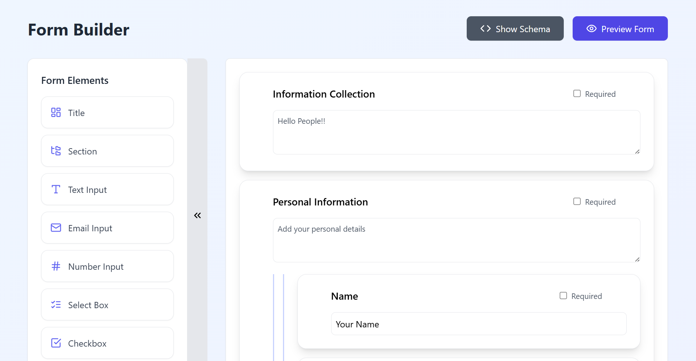

# Dynamic Form Builder

A powerful React-based form builder application that allows users to create, customize, and preview forms with a drag-and-drop interface. Built with React, TypeScript, and modern UI libraries.



## Features

- **Drag-and-Drop Interface**: Create forms by dragging and dropping various form elements
- **Nested Sections**: Group related fields together in collapsible sections
- **Form Preview**: See how your form looks in real-time with a preview mode
- **JSON Schema Generation**: Automatically generate JSON Schema from your form structure
- **Form Validation**: Built-in validation based on the JSON Schema
- **Responsive Design**: Works seamlessly on desktop and mobile devices

## File Structure

```
src/
├── components/
│   ├── FormBuilder.tsx       # Main component orchestrating the form builder
│   ├── FormCanvas.tsx        # Canvas area where form elements are placed
│   ├── FormElement.tsx       # Individual form element component
│   ├── FormPreview.tsx       # Preview component for the built form
│   ├── Toolbox.tsx           # Toolbox containing draggable form elements
│   └── ui/                   # UI components (from shadcn/ui)
├── utils/
│   └── schemaConverter.ts    # Utility for converting form elements to JSON Schema
├── App.tsx                   # Main application component
└── index.tsx                 # Entry point
```

## Installation

1. Clone the repository:
   ```bash
   git clone https://github.com/yourusername/form-builder.git
   cd form-builder
   ```

2. Install dependencies:
   ```bash
   npm install
   # or
   yarn install
   ```

3. Start the development server:
   ```bash
   npm run dev
   # or
   yarn dev
   ```

4. Open your browser and navigate to `http://localhost:5173` (or the port shown in your terminal)

## Dependencies

- React
- TypeScript
- @dnd-kit/core & @dnd-kit/sortable: For drag-and-drop functionality
- Lucide React: For icons
- Ajv: For JSON Schema validation
- Tailwind CSS: For styling

## How to Use

1. **Create a Form**: Drag elements from the toolbox on the left to the canvas on the right
2. **Customize Elements**: Click on an element to edit its properties (label, placeholder, etc.)
3. **Create Sections**: Drag the "Section" element to group related fields
4. **Preview Form**: Click the "Preview Form" button to see how your form looks and test it
5. **View JSON Schema**: Click "Show Schema" to see the generated JSON Schema
6. **Submit Form**: In preview mode, fill out the form and submit it to see validation in action

## Contribution Ideas

Here are some areas where you could contribute to the project:

### New Form Elements
- Date picker
- File upload
- Rich text editor
- Rating input
- Signature field
- Address fields with autocomplete

### Feature Enhancements
- Form templates/presets
- Form data export (CSV, JSON)
- Conditional logic (show/hide fields based on conditions)
- Multi-page forms
- Save/load form designs
- Undo/redo functionality
- Keyboard shortcuts
- Accessibility improvements

### Integration Possibilities
- Backend integration for form submission
- Database storage for form responses
- User authentication for form creators
- Analytics for form submissions
- Email notifications for form submissions

### UI/UX Improvements
- Dark mode
- Customizable themes
- Mobile responsiveness improvements
- Guided tour for new users

## Contributing

1. Fork the repository
2. Create a feature branch (`git checkout -b feature/amazing-feature`)
3. Commit your changes (`git commit -m 'Add some amazing feature'`)
4. Push to the branch (`git push origin feature/amazing-feature`)
5. Open a Pull Request

## License

This project is licensed under the MIT License - see the LICENSE file for details.

## Acknowledgments

- [dnd-kit](https://github.com/clauderic/dnd-kit) for the drag-and-drop functionality
- [Lucide](https://lucide.dev/) for the beautiful icons
- [shadcn/ui](https://ui.shadcn.com/) for the UI components
- [Tailwind CSS](https://tailwindcss.com/) for the styling framework